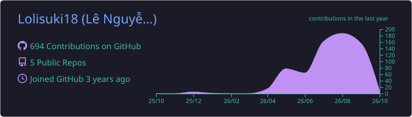
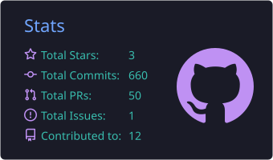
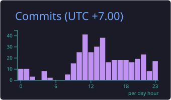
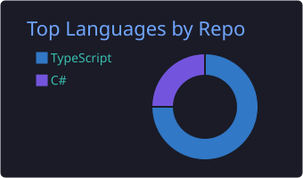
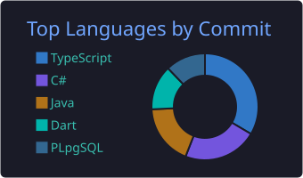

<h1 align="center">Hi, I'm Lê Nguyễn An Ninh 👋</h1>

  

  

---

<h2 align="center">🚀 About Me</h2>

  🚀 <b>Open to work:</b> Fullstack Developer (.NET / React / Next.js) 
  💻 I build web apps end to end, from the database and APIs to the UI 
  ⚙️ Backend with <b>C# / .NET</b>, frontend with <b>React / Next.js / TypeScript</b> 
  🔭 Currently building my own ecosystem of deployed projects, starting with my portfolio 
  📫 Reach me at <b>leninh2004@gmail.com</b>

---

<h2 align="center">🛠️ Tech Stack</h2>

<h3 align="center">Languages</h3>

  
  
  
  
  
  
  

<h3 align="center">Frameworks & Libraries</h3>

  
  
  
  
  
  

<h3 align="center">Databases</h3>

  

<h3 align="center">Tools</h3>

  
  
  
  

---

<h2 align="center">🚀 Live Projects</h2>

| Project | Description | Tech | Live Demo |
| :-- | :-- | :-- | :-- |
| **Ninh Lê** (Portfolio) | Personal CV and portfolio | Next.js | [ninhhub.id.vn](https://ninhhub.id.vn) |
| **Góc của Ninh Lê** | Personal blog on tech, knowledge and reflections | Next.js | [corner.ninhhub.id.vn](https://corner.ninhhub.id.vn) |
| **Verdbench** | 40+ free developer tools that run 100% in the browser: JSON formatter, JWT decoder, Regex tester, cURL converter... | Next.js | [verdbench.ninhhub.id.vn](https://verdbench.ninhhub.id.vn) |
| **Picsmith** | Free image & PDF toolkit in the browser: compress images, AI background removal, PDF signing, QR codes... No uploads | Next.js | [image.ninhhub.id.vn](https://image.ninhhub.id.vn) |

---

<h2 align="center">📊 GitHub Stats</h2>

  

  
  

  
  

---

<h2 align="center">🐍 Contribution Snake</h2>

  <picture>
    <source media="(prefers-color-scheme: dark)" srcset="https://raw.githubusercontent.com/Lolisuki18/Lolisuki18/output/github-snake-dark.svg" />
    <source media="(prefers-color-scheme: light)" srcset="https://raw.githubusercontent.com/Lolisuki18/Lolisuki18/output/github-snake.svg" />
    
  </picture>

---

<h2 align="center">🤝 Let's Connect</h2>

  
  
  

  <i>⭐️ Thanks for stopping by!</i>

